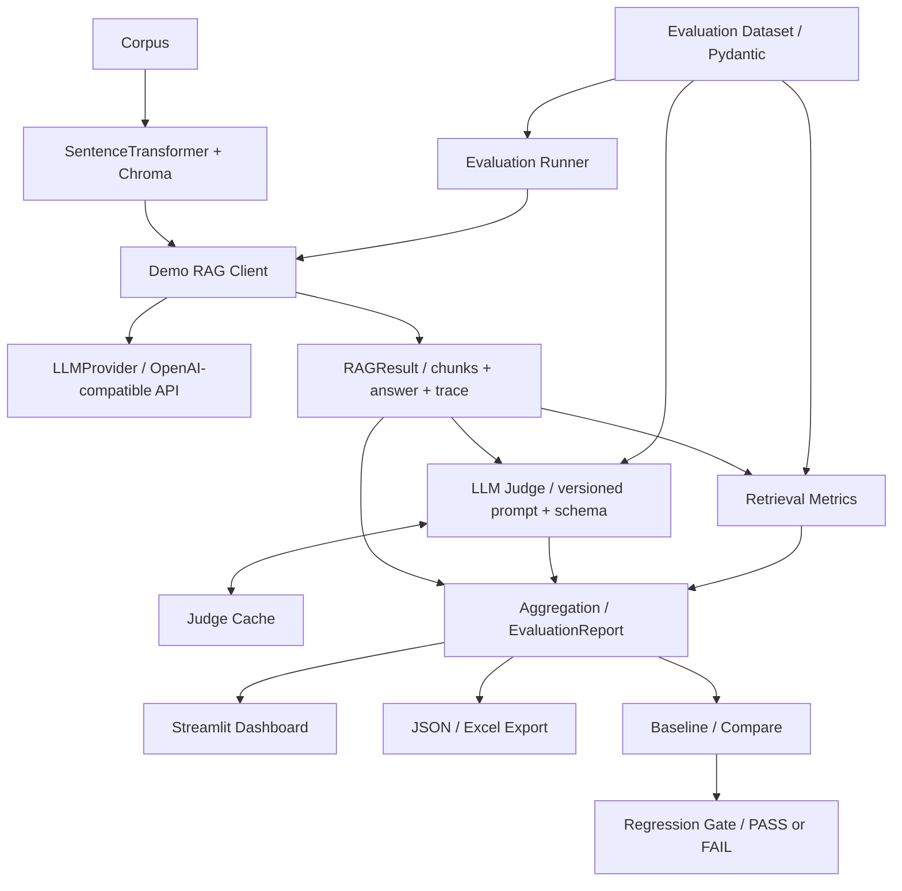
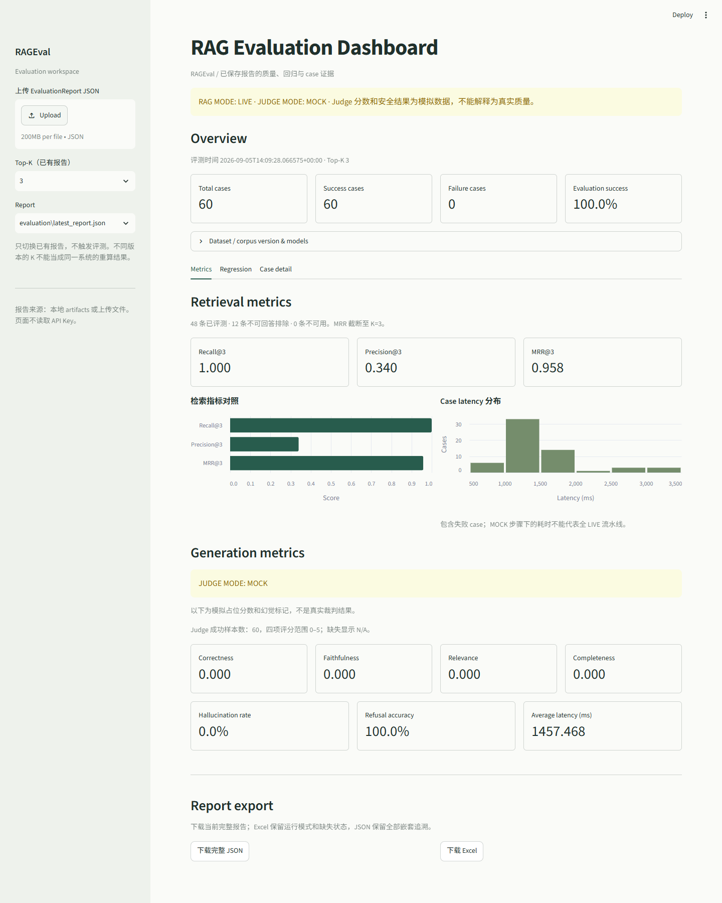
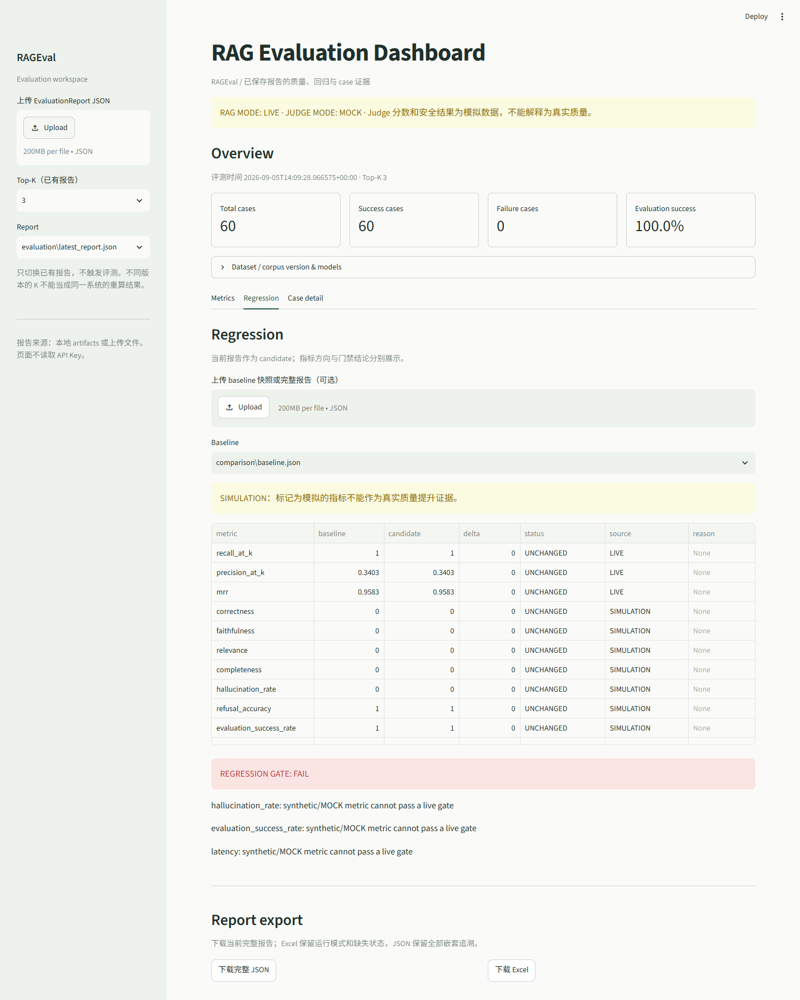
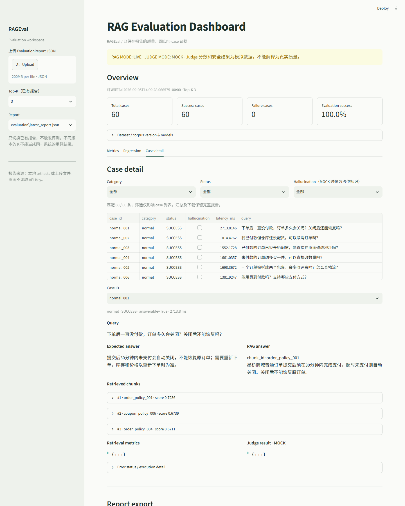

# RAGEval

**RAG 知识库质量自动化评测框架。** 将检索、生成、安全和工程稳定性放进同一条可追溯的评测流水线，用报告判断一次改动是否值得保留。

RAG 项目常遇到三个问题：检索质量无法量化、回答质量难以系统评估、新版本容易产生回归。RAGEval 用带标注的数据集、分阶段指标和阈值门禁回答这些问题。项目定位是评测框架，本地 Demo RAG 是被测对象，Dashboard 用于查看证据。

> 当前公开示例：真实 BGE/Chroma 检索 + 真实 GLM 生成 + **MOCK Judge**。
> Judge 的占位分数、幻觉率和拒答探针不能当作真实生成质量；当前真实质量门禁未通过。

## Features

| 能力 | 已实现内容 |
| --- | --- |
| Retrieval Evaluation | 基于 chunk_id 的 Recall@K、Precision@K、RR 与 MRR |
| Generation Evaluation | Correctness、Faithfulness、Relevance、Completeness，0–5评分及Schema校验 |
| Safety Evaluation | Hallucination、unsupported claims、显式拒答观察与Refusal统计 |
| Regression Testing | Baseline快照、11项指标对比、YAML阈值门禁及失败原因 |
| Evaluation Dashboard | 报告/K切换、指标卡与图表、版本对比、case筛选及原始证据 |
| Report Export | 完整JSON；Summary、Case Results、Retrieval Metrics、Judge Results四表Excel |
| Reliability | Provider抽象、分类重试、指数退避、Retry-After、请求超时及Judge缓存 |

Correctness衡量与标准答案是否一致，Faithfulness衡量回答是否被检索上下文支持，两者可以不同。失败case保留错误类型、耗时和重试记录，不静默丢弃。

## Architecture



评测层通过客户端抽象调用被测系统；报告展示与导出只读已有结果。Dataset和Corpus使用SHA-256标识版本，检索命中统一比较 `RetrievedDocument.chunk_id` 与 `EvalCase.relevant_doc_ids`。

## Quick Start

Python **3.10+**，CI使用 **3.11**。以下从源码仓库根目录运行。

```bash
git clone https://github.com/gongyang0076-debug/RAGEval.git
cd RAGEval
python -m venv .venv
```

Windows PowerShell：

```powershell
.venv\Scripts\Activate.ps1
pip install -r requirements.txt
# 首次配置时执行；已有.env请保留。
copy .env.example .env
streamlit run app.py
```

macOS/Linux：

```bash
source .venv/bin/activate
pip install -r requirements.txt
cp -n .env.example .env
streamlit run app.py
```

打开 `http://127.0.0.1:8501`。仓库带有已审核的历史报告，**看Dashboard不需要API Key，也不会下载Embedding或运行评测**。若只使用CPU，可先执行 `pip install torch --index-url https://download.pytorch.org/whl/cpu`，再安装requirements。

### 运行真实评测

在本地 `.env` 填写供应商配置，进程环境变量优先。不要把密钥写进源码或提交Git。

| 环境变量 | 用途 |
| --- | --- |
| `RAG_API_KEY` / `RAG_BASE_URL` / `RAG_MODEL` | 生成服务；base URL须为供应商的OpenAI-compatible API地址 |
| `JUDGE_API_KEY` / `JUDGE_BASE_URL` / `JUDGE_MODEL` | 独立Judge服务 |
| `JUDGE_RESPONSE_FORMAT` | 默认 `json`；GLM 使用 `json_object`，仍执行本地 Schema 校验 |
| `JUDGE_MODE` | 默认LIVE；MOCK只能显式启用，不是API失败后的自动降级 |
| `RAG_EMBEDDING_MODEL` | 默认 `BAAI/bge-small-zh-v1.5` |
| `RAG_GENERATION_TIMEOUT_SECONDS` / `JUDGE_TIMEOUT_SECONDS` | 单请求超时，默认60秒 |
| `RAG_MAX_ATTEMPTS` / `JUDGE_MAX_ATTEMPTS` | 最大总尝试次数，默认3 |

```bash
# 真实检索，无LLM；首次运行需下载Embedding模型
python -m src.metrics.benchmark

# 真实RAG + 真实Judge，需配置两组API变量
python -m src.evaluation.runner --dataset data/datasets/ecommerce_eval_v1.json --top-k 3 --output artifacts/my-run --judge-mode LIVE

# 真实RAG + 显式MOCK Judge，仅验证流水线
python -m src.evaluation.runner --dataset data/datasets/ecommerce_eval_v1.json --top-k 3 --output artifacts/my-smoke --judge-mode MOCK

# 无API的受控版本对比演示，全部为MOCK
python -m src.comparison.demo --output artifacts/my-comparison

# 导出已有报告，不运行LLM
python -m src.report --report artifacts/evaluation/latest_report.json --output artifacts/my-export
```

Runner完成后即使存在失败也保存报告，并返回非零退出码。模型、向量库和Judge缓存默认放在被忽略的 `.cache/`。

### Regression Gate

默认规则见 [config/regression_gate.yaml](config/regression_gate.yaml)：Recall@3≥0.85、MRR≥0.8、幻觉率≤0.1、评测成功率≥0.95、平均延迟增幅≤20%。

```python
from src.report import load_report
from src.comparison import load_baseline, compare_reports, apply_gate, load_gate_config

baseline = load_baseline("artifacts/comparison/baseline.json")
candidate = load_report("artifacts/evaluation/latest_report.json")
comparison = compare_reports(baseline, candidate)
gate = apply_gate(comparison, load_gate_config("config/regression_gate.yaml"))
print(gate.model_dump_json(indent=2))
```

`delta = candidate - baseline`；幻觉率与延迟越低越好，其余指标越高越好。指标变差与触发门禁是两件事，Gate按配置阈值判断。缺失指标、不可比样本集合和未经允许的模拟分数不会得到虚假PASS。示例基线含MOCK Judge，因此默认完整门禁FAIL是预期行为。

## Dataset

统一场景为**合成电商客服知识库**，不是生产用户数据。

- Corpus：**36个chunk**，订单、支付、退款、物流、优惠券、会员/售后六类主题各6个。
- Evaluation Dataset：**60条case**，48条answerable、12条不可回答。
- `chunk_id` 全局唯一；标注 `relevant_doc_ids` 实际引用chunk_id。
- 结构、重复ID和引用关系由Pydantic及Loader校验。

| Category | 数量 | 用途 |
| --- | ---: | --- |
| normal | 30 | 常规事实问题 |
| unanswerable | 10 | 知识库没有依据的问题 |
| invariance | 12 | 6组同义变体，使用variant_group |
| adversarial | 8 | 诱导编造、错误前提；其中2条也不可回答 |

指标按 `answerable` 字段决定是否参与检索评测，不能只按category统计。更多标注约定见 [data/README.md](data/README.md)。

## Benchmark

以下保留原有历史实验；后续 GLM 实际验证及评分限制见 [Live Judge 验证记录](docs/live-judge-validation.md)。正式数据未为提升结果而修改。

### 真实 Retrieval 结果

来源：[retrieval_benchmark.json](artifacts/sprint4/retrieval_benchmark.json)。使用BGE small中文模型和Chroma，对全部 **48条answerable case** 进行检索；12条不可回答明确排除。

| K | Recall@K | Precision@K | MRR@K | 未完全召回case |
| ---: | ---: | ---: | ---: | ---: |
| 1 | 0.9063 | 0.9167 | 0.9167 | 5 |
| 3 | 1.0000 | 0.3403 | 0.9583 | 0 |
| 5 | 1.0000 | 0.2042 | 0.9583 | 0 |

Recall分母是全部相关chunk数，Precision分母是实际返回的Top-K条数；重复chunk只计一次命中但仍占位置。采用逐case宏平均，MRR截断到对应K。K=1有4条完全未命中，另1条只召回部分相关chunk。

这些结果只说明此小规模合成集上的表现，不意味着生产场景100%召回或泛化保证。

### 真实生成 + MOCK Judge

保存的 [完整报告](artifacts/evaluation/latest_report.json) 使用 `glm-4-flash-250414`：60条成功、0失败、0重试，平均case延迟约1457.47ms。该成功率表示流水线执行成功，不是答案正确率。

**JUDGE MODE: MOCK**：

- 四项Judge均分为0占位，不能解读为真实0分或模型质量结论。
- 幻觉率0是占位标记，不能宣称“无幻觉”。
- 拒答12/12来自关键词探针，不是真实裁判评估。
- Sprint 8对比演示的排名、生成、评分和延迟全为MOCK，仅用于验证门禁行为。

### 已知限制

真实Judge质量依赖外部模型及Prompt；Demo corpus是合成数据，规模较小。更换数据域后需重新标注和评测。阈值门禁不包含统计显著性分析；Chroma弃用警告来自第三方依赖。一次API调用成功不保证供应商长期可用。

## Screenshots

截图来自实际运行的Dashboard，显示真实RAG报告及明确的MOCK Judge提示。

### Dashboard Overview


### Regression


### Case Detail


## Development & CI

```bash
python -m pytest -q
python scripts/check_imports.py
python scripts/check_release.py
```

[GitHub Actions](.github/workflows/test.yml) 在main推送、PR和手动触发时运行：Ubuntu、Python3.11、CPU依赖、模块导入及完整pytest。测试不需要密钥，使用mock LLM及固定向量；下载模型的真实smoke与Benchmark独立运行。

数据JSON通过 `.gitattributes` 禁用换行转换，保留SHA-256版本字节。

发布范围由Git忽略规则控制：不含.env、模型权重、Chroma/Embedding缓存、临时环境与未审核报告；仅白名单中的历史产物公开。见 [artifacts说明](artifacts/README.md) 和 [发布检查记录](docs/release-check.md)。

## Project Structure

```text
RAGEval/
├── app.py
├── .github/workflows/test.yml
├── .streamlit/config.toml
├── .env.example
├── config/                 # 环境配置、Judge与门禁阈值
├── data/
│   ├── corpus/             # 36个合成知识块
│   └── datasets/           # 60条标注case
├── src/
│   ├── dataset/            # Pydantic契约与Loader
│   ├── rag/                # 本地Demo被测系统
│   ├── llm/                # Provider、重试、超时
│   ├── metrics/            # 检索指标
│   ├── judge/              # 版本化Prompt、评分与Schema
│   ├── evaluation/         # Runner、聚合、缓存
│   ├── comparison/         # Baseline、Compare、Gate
│   └── report/             # Dashboard、JSON/Excel
├── tests/
├── scripts/                # 导入与发布文件检查
├── artifacts/              # 已审核报告；运行产物默认忽略
├── docs/                   # 截图、验证记录、详细使用说明
├── pyproject.toml
└── requirements.txt
```

详细API、边界规则及配置示例见 [使用说明](docs/usage-guide.md)。本仓库当前面向源码运行与项目展示，未发布PyPI包；未附开源许可证，不宣称第三方已获得开源再分发授权。

## 可选 Reranker 与检索对比

新增两阶段检索：BGE Embedding + Chroma 初召回 10 条，再由 `BAAI/bge-reranker-base` 对“问题、知识块”联合评分，返回 Top-K。原有默认检索行为不变。

```bash
python -m src.metrics.rerank_benchmark --candidate-k 10 --output artifacts/reranker/comparison.json
```

此命令使用真实本地模型，不调用生成模型和 Judge；首次运行需要下载公开模型权重，缓存位于 Git 忽略的 `.cache/huggingface/`。支持 `--reranker-model` 指定其他兼容的单分数 CrossEncoder 模型或本地模型目录。设备和缓存目录沿用 Embedding 配置。

报告在同一份 Corpus、Dataset 和同一次候选召回上比较 K=1、3、5 的 Recall、Precision 和截断 MRR@K，保存逐题候选、重排结果、改善和退步案例，以及预热后的检索/重排序耗时。不可回答题排除。初召回没有找到的资料，重排序无法补回。

Python 中可以将 `RerankingRetriever(base_retriever, reranker, candidate_k=10)` 传入 `DemoRAGClient`，生成流程无需改变。最终 K 不得超过候选数量。原始向量分数为余弦相似度；重排序分数为原始 logit，越高越相关，不能当成概率，也不能与原始分数直接相减比较。

详细用法和实验结论见 [重排序实验](docs/reranker-experiment.md)。
