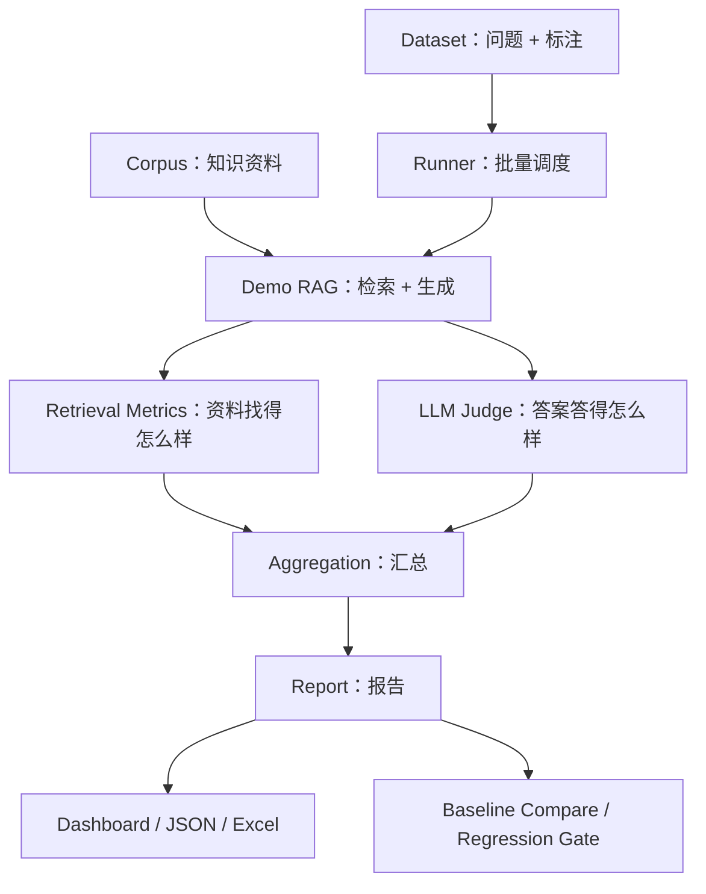

# RAGEval 项目术语词典

面向第一次接触 RAG、测试开发和 AI 测试的读者。解释基于当前项目，扩展方案会明确标记。

## 先认识整个项目

可以把 RAGEval 理解为一个自动考试系统：

- 知识库是允许考生查阅的资料。
- Dataset 是试卷，其中记录题目、参考答案和应查到的资料。
- Demo RAG 是考生，先查资料，再组织答案。
- 检索指标检查有没有找对资料。
- LLM Judge 是辅助阅卷老师，它本身也可能判错。
- Runner 负责依次发题、收卷和汇总。
- Report 是成绩与答题明细，Dashboard 是查看这些记录的页面。
- Regression Gate 根据设定规则检查新版本是否允许通过。



## 一、项目定位与整体架构

| 术语 | 通俗解释 | 在本项目中的意思 |
| --- | --- | --- |
| RAGEval | 项目名称，可以理解为 RAG Evaluation，即 RAG 评测 | 给 RAG 系统做检索、生成、安全和工程质量评测 |
| RAG | Retrieval-Augmented Generation，检索增强生成 | 先从知识库找资料，再让模型参考资料回答 |
| LLM | Large Language Model，大语言模型 | 能理解和生成语言的模型，当前生成与 Judge 都调用 GLM |
| GLM | 本项目所使用的模型系列名称 | 当前实际调用型号是 glm-4-flash-250414，不是项目自行训练的模型 |
| Evaluation | 评测 | 按指定规则测量表现，产生分数与证据 |
| SUT / 被测系统 | System Under Test，被测试的对象 | Demo RAG 是被测对象，RAGEval 评测层是测试工具 |
| Demo | 用于展示或验证的最小实例 | 项目中的本地 RAG 用来验证评测框架能否工作 |
| Framework / 框架 | 把共用流程和接口组织起来，方便重复使用与扩展 | 换一套符合接口的 RAG，仍可使用评测逻辑 |
| Architecture / 架构 | 模块如何划分、如何交互 | 数据、被测系统、指标、Judge、Runner、比较和报告各有职责 |
| Pipeline / 流水线 | 多个处理步骤按流程串起来 | 加载数据、运行 RAG、评分、汇总、保存报告 |
| Module / 模块 | 一块职责相对集中的代码 | 比如 retrieval.py 专门计算检索指标 |
| Package / 包 | 组织 Python 模块的目录单元 | src/judge、src/metrics 等目录组织不同功能，项目补齐了 __init__.py |
| Abstraction / 抽象 | 约定调用者需要什么能力，把实现细节藏在内部 | 调用方只需要知道 Provider 能生成文本，不必知道 SDK 的具体调用方式 |
| Interface / 接口契约 | 调用方式以及输入输出的约定 | RAGClient 约定 retrieve 和 run 两种操作 |

**例子：RAG 与普通模型回答有什么区别？**

用户问“未支付订单多久关闭”。如果只让模型凭已有知识回答，它可能不知道这家商城的具体规定。RAG 会先找到商城政策“30 分钟未支付自动关闭”，再把它交给模型回答。RAG 仍然可能找错或答错，所以需要评测。

## 二、知识库、试卷与数据契约

| 术语 | 通俗解释 | 在本项目中的意思 |
| --- | --- | --- |
| Knowledge Base / 知识库 | 给系统查阅的业务资料集合 | 电商客服政策 |
| Corpus / 语料库 | 被组织起来、供处理或检索的文本资料 | data/corpus 中的 36 个合成知识块 |
| Document / 文档 | 一份原始资料或一个文档单位 | 比如退款政策文档 |
| Chunk / 知识块 | 从文档中划分出的检索单位 | 一块内容可以只讲退款路径，另一块讲退款时效 |
| Chunking / 切块 | 把长文档分成多个知识块 | 当前 Demo 数据已经是准备好的块，没有实现通用 PDF 自动切块流水线 |
| doc_id | 文档编号 | 多个知识块可以属于同一个文档编号 |
| chunk_id | 具体知识块的编号 | 全局唯一，是检索命中判断的主要依据 |
| content | 文本内容 | 知识块里实际写的政策 |
| Metadata / 元数据 | 描述数据的数据 | 比如主题、来源、版本、是否合成 |
| Dataset / 数据集 | 按用途组织的一组样本 | 这里通常指评测试卷，与提供资料的 Corpus 不同 |
| EvalCase / Case | 一条评测用例 | 一道问题及其参考答案、相关块标注等 |
| Query | 输入的问题或查询文本 | “退款退到哪里？” |
| Ground Truth | 评测时作为参照的标准标注 | 标准答案与相关知识块编号；它也可能漏标或标错，需要核对 |
| expected_answer | 标准答案字段 | 指出这道题应回答的业务事实，不要求模型逐字照抄 |
| relevant_doc_ids | 应该命中的知识块编号列表 | 虽然字段名带 doc，当前保存的实际是 chunk_id |
| answerable | 根据知识库是否能够回答 | true 表示应该有依据，false 表示资料不足 |
| Category / 类别 | 用例关注哪类问题 | normal、unanswerable、invariance、adversarial |
| normal | 常规问题 | 正常询问订单或退款政策 |
| unanswerable | 知识库不足以回答的问题类别 | 资料没有会员售价，却询问具体价格 |
| invariance / 不变性 | 改变表达后，核心业务结论应保持稳定 | “退款去哪里”和“退的钱回哪个账户”属于相近问法 |
| variant_group | 同义变体的分组编号 | 把应保持相同核心含义的问题放在一组 |
| adversarial / 对抗样例 | 刻意加入误导或诱导，测试系统是否犯错 | “既然延期必赔 100 元，怎么申请？”但政策没有这个承诺 |
| Synthetic Data / 合成数据 | 为测试目的构造的数据 | 星桥商城是虚构业务，不能说成真实生产客户数据 |
| Annotation / 标注 | 为样本填写参照答案或标签 | 给一条问题标出应命中的知识块 |
| Data Contract / 数据契约 | 数据必须满足的字段、类型与约束 | rank 必须为正整数、chunk_id 不能为空等 |
| Validation / 校验 | 检查数据是否符合规则 | 检查格式、字段、重复编号与引用是否存在 |
| Schema | 描述数据结构和规则的规范 | 哪些字段必填、分数允许什么范围 |
| Pydantic | Python 数据建模与校验库 | 通过模型类检查输入和输出是否合法 |
| Loader / 加载器 | 读取文件并转成程序可用数据的代码 | 加载 Corpus、Dataset 并进行校验 |
| Serialization / 序列化 | 把程序对象转换成便于保存或传输的格式 | 把 EvaluationReport 转成 JSON |
| Deserialization / 反序列化 | 把保存的格式读回程序对象 | 读取 JSON，再恢复成报告模型 |

**例子：Corpus 与 Dataset 不是同一件东西。**

Corpus 写：“普通订单 30 分钟未支付自动关闭。”

Dataset 写：“问题：订单多久关闭？标准答案：30 分钟。相关块：order_policy_001。”

前者给被测系统提供知识，后者让评测系统知道应该检查什么。标准答案不会作为 RAG 生成时的资料偷偷传给考生；它会传给 Judge 用于判卷。

**例子：doc_id 与 chunk_id。**

一本手册可以只有一个 doc_id，但分成多个 chunk_id。题目需要“退款时效”，只找到同一本手册中的“退款渠道”，不能因为文档相同就自动算检索命中。

## 三、Embedding 与向量检索

| 术语 | 通俗解释 | 在本项目中的意思 |
| --- | --- | --- |
| Retrieval / 检索 | 从资料中查找与问题有关的内容 | 从 36 个知识块返回相关候选 |
| Semantic / 语义 | 一段话表达的意思 | “钱退回哪里”和“退款到账账户”用词不同但意思相近 |
| Embedding / 向量表示 | 把文本转换成一组数字，以便比较 | 用 BGE 把问题和知识块转成向量 |
| Vector / 向量 | 一组有顺序的数值 | 可想成文本在数学空间里的坐标，但各维通常不能直接解释成具体业务属性 |
| Dimension / 维度 | 向量里有多少个数 | 两套模型的向量长度或含义不同，通常不能直接混用 |
| Embedding Model | 负责把输入转成向量的模型 | BAAI/bge-small-zh-v1.5，负责表示文本，不负责直接生成客服答案 |
| BGE | 本项目选用的 Embedding 模型系列名称 | small-zh-v1.5 是当前具体中文模型，不是指标名 |
| SentenceTransformer | 用于加载文本向量模型并编码文本的 Python 工具 | 代码中通过 encode 得到文本向量 |
| PyTorch / Torch | 支持张量运算和模型运行的基础框架 | 属于本地模型运行依赖，项目没有用它训练自己的模型 |
| Normalize / 归一化 | 按指定规则调整数值尺度 | 本项目将向量归一化，便于一致地使用余弦比较 |
| Cosine Similarity / 余弦相似度 | 比较两个向量方向是否接近 | 方向越接近通常表示模型认为语义越接近；不是业务正确率 |
| Cosine Distance / 余弦距离 | 用距离形式表示方向差异 | 当前分数转换使用 score=1-distance，使分数越高越相关 |
| Vector Database / 向量数据库 | 保存向量并按相似度查找的系统 | Chroma 保存向量、文本和编号 |
| Chroma | 本项目使用的向量数据库工具 | 负责本地持久化集合与查询 |
| Collection / 集合 | 向量数据库里的一组记录 | 类似把同一套模型编码的知识块放进一个容器 |
| Index / 索引 | 为加速查找建立的结构；也可指把数据写入检索系统的动作 | index(corpus) 会编码并同步知识块 |
| HNSW | 一种常见的近似近邻向量索引算法 | 由 Chroma 内部提供，项目只配置和使用，没有自行实现底层算法 |
| Similarity Search / 相似度搜索 | 按向量接近程度找候选 | 用问题向量查询 Chroma |
| Top-K | 排在最前面的 K 条结果 | top_k=3 表示最多取前 3 条 |
| Rank / 排名 | 结果排在第几个位置 | 从 1 开始，第一条 rank=1 |
| Score / 得分 | 检索系统对候选相关程度的数值表示 | 高分不代表“有同等百分比的正确概率” |
| Query Instruction / 查询指令 | 编码问题前加的一段说明 | 项目只在查询侧加检索指令，文档侧不加 |
| Upsert | 有同编号记录就更新，没有就插入 | 同一 chunk_id 的内容改变后同步进 Chroma |
| Persistence / 持久化 | 程序结束后数据仍保存 | Chroma 存在本地目录，下次可以重新打开 |

**例子：Embedding 不是一份关键词表。**

“退款多久到账”和“退回的钱什么时候能收到”没有完全相同的字面内容，但向量模型可能把它们放得较近。这样的相近只是模型给出的候选依据，还需要真实标注检验，不能把“向量近”直接当作“业务上一定相关”。

**例子：分数不等于概率。**

检索 score=0.8，表示按当前距离转换得到 0.8，不表示答案正确率为 80%。不同模型的分数也不能未经校准就直接比较。

## 四、检索与生成质量指标

| 术语 | 通俗解释 | 在本项目中的意思 |
| --- | --- | --- |
| Metric / 指标 | 把某种表现转成可比较的数值 | Recall、MRR、平均耗时等 |
| Hit / 命中 | 检索结果属于标准标注的相关集合 | 返回的 chunk_id 出现在 relevant_doc_ids 中 |
| Recall@K / 召回率 | 需要的资料找到了多少 | Top-K 命中的唯一相关块数 / 全部唯一相关块数 |
| Precision@K / 精确率 | 找回来的资料中多少被标注为相关 | 唯一相关命中数 / 实际返回的 Top-K 条数 |
| RR | Reciprocal Rank，倒数排名 | 第一条相关结果 rank 的倒数；没命中是 0 |
| MRR | Mean Reciprocal Rank，平均倒数排名 | 多道有效题的 RR 平均值；Benchmark 会截断到指定 K |
| Macro Average / 宏平均 | 先分别算每条样本的分数，再平均 | 每一道有效评测题具有相同权重 |
| Micro Average / 微平均 | 先汇总计数，再计算整体比例 | 扩展概念；当前检索均分使用宏平均，不能把两者混用 |
| Correctness / 正确性 | 回答是否符合标准答案的事实 | 满分 5 分，不能只看回答语气是否肯定 |
| Faithfulness / 忠实性 | 回答的事实能否被实际上下文支持 | 忠实复述错误资料也可能不符合标准答案 |
| Answer Relevance / 回答相关性 | 是否回应当前问题 | 用户问退款渠道，回答却介绍会员权益，相关性低 |
| Completeness / 完整性 | 必要要点是否答全 | 问关闭时间和能否恢复，只回答时间就不完整 |
| Hallucination / 幻觉 | 当前口径下，回答作出上下文不支持或否定的事实断言 | 凭空承诺延误赔 100 元 |
| Unsupported Claims | 没有上下文依据的具体断言 | Judge 必须指出“每延误一天赔 100 元”等具体内容 |
| Refusal / 拒答 | 明确表示资料不足、无法确定或无法回答 | “知识库没有提供会员售价，无法确定” |
| Refusal Detection | 识别答案是否表达了拒答 | refusal_detected 只是观察行为，不等于拒答一定正确 |
| Refusal Accuracy / 拒答准确率 | 不可回答题中有多少被正确拒答 | 当前要求检测到拒答且没有被判为幻觉，再除以全部不可回答题 |
| Hallucination Rate / 幻觉率 | 被 Judge 标为有幻觉的结果比例 | 分母为 Judge 成功评估的题数，不是人工确认的漏报率 |
| Evaluation Success Rate | 评测执行成功率 | SUCCESS 数量 / 全部题数，与答案正确率不同 |
| Denominator / 分母 | 比例中作为总体的数量 | 检索、生成、拒答指标的分母并不相同 |
| Missing / Null / None | 没有可用数值 | 没有评估与评估后得 0 分不是同一回事 |

**例子：Recall、Precision、RR 一起算。**

相关知识块只有 A，返回顺序是 X、A、Y：

- Recall@3=1/1=1，需要的块找到了。
- Precision@3=1/3，三条中只有一条被标注为相关。
- RR=1/2，第一条相关结果位于第二位。

如果两道题的 RR 分别是 1 和 1/2，MRR=(1+1/2)/2=0.75。不可回答题不放进普通检索均分。

**例子：宏平均和微平均为什么不同？**

题一需要 1 块，找到 1 块；题二需要 9 块，找到 0 块。

- 宏平均 Recall=(1+0)/2=0.5，每道题权重一样。
- 汇总计数得到的微平均 Recall=(1+0)/(1+9)=0.1，每个相关块权重一样。

当前项目用前一种，报告比较时需要统一口径。

**例子：正确性与忠实性。**

标准答案是 30 分钟，上下文写 60 分钟，模型回答 60 分钟：Correctness 应低，Faithfulness 可以高。若上下文没有时间，模型猜对 30 分钟：正确性可以高，但该断言没有上下文支持。

**例子：拒答不等于正确拒答。**

“我不确定，但会员大概 9.9 元”表达了不确定，还编造价格。即使 refusal_detected=true，只要存在幻觉，项目也不会算正确拒答。当前 GLM 对拒答字段有误判，因此真实分数仍需要人工校准。

## 五、Prompt、Judge 与模型输出

| 术语 | 通俗解释 | 在本项目中的意思 |
| --- | --- | --- |
| Generation / 生成 | 模型组织并输出文字的过程 | GLM 根据问题和检索资料生成回答 |
| Context / 上下文 | 当前请求中提供给模型的背景资料 | RAG 中主要是检索到的知识块；不是指模型训练过的全部知识 |
| Context Window / 上下文窗口 | 一次请求能够容纳的输入与输出长度范围 | 扩展测试关注点；当前未系统完成长上下文测试 |
| Prompt / 提示词 | 给模型的任务说明和输入 | 说明只能依据知识库回答，或只做评分 |
| System Prompt | 描述任务规则的系统消息 | 要求资料不足时拒答、Judge 不回答原问题等 |
| User Message | 传入本次具体任务数据的消息 | 问题、检索上下文，或待评答案等 |
| LLM-as-Judge | 用大模型辅助判断答案质量 | 一个模型负责答题，另一次模型请求负责评分 |
| Rubric / 评分规则 | 各维度如何判断、什么情况给几分 | 比如 0 分完全不满足，5 分完全满足该维度 |
| Prompt Version / 版本化 Prompt | 给评分规则明确标识 | judge_v1、judge_v2；变化应留痕，避免量尺变了却继续比较 |
| Temperature / 温度 | 控制输出采样随机性的一类参数 | Judge 设置为 0 降低变化，但不保证绝对确定 |
| Token | 模型处理文本时使用的切分单位 | 不严格等于一个汉字或一个单词；请求长度与计费常以它为单位，项目尚未完整统计成本 |
| Structured Output / 结构化输出 | 让模型按指定结构返回 | 以固定 JSON 字段返回分数，而不是随意一段评论 |
| JSON Schema | 描述 JSON 对象字段、类型和约束的规范 | 要求四项整数分数、布尔值、列表和理由等 |
| json 模式 | 本项目保留的通用输出配置名称 | 只用 Prompt 要求严格 JSON，再本地校验，不发送供应商 JSON 模式参数 |
| json_object 模式 | 请求供应商返回 JSON 对象的输出模式 | 已适配 GLM；能改善格式，但本地仍需检查字段和分数 |
| json_schema 模式 | 向支持它的供应商提交 Schema 约束 | 是否支持取决于服务，不能把它与 json_object 当成完全相同 |
| Raw Output / 原始输出 | 模型未经应用修正的返回文本 | 用来核对为什么解析失败或裁判为什么判错 |
| Reason / 评分理由 | 模型说明给分依据的短文本 | 它也可能自相矛盾，不能因为写了理由就认为判断正确 |
| Calibration / 校准 | 用可信参照衡量并调整评测工具的判断 | 当前尚未完成独立人工校准，已用人工样例发现裁判误判 |
| Human Review / 人工复核 | 人依据资料和规则检查结果 | 用于核对标注、裁判分歧和高风险结论 |

**例子：JSON 合法不代表评分正确。**

```json
{
  "answer_correctness": 4,
  "faithfulness": 5
}
```

这段文本语法上是 JSON，但缺少项目要求的其他字段，不能通过完整 Judge Schema。即使补齐字段，若答案明显违反标准答案却给高分，也仍可能是语义误判。

## 六、接口调用、配置与错误

| 术语 | 通俗解释 | 在本项目中的意思 |
| --- | --- | --- |
| API | Application Programming Interface，程序调用另一个系统的入口 | Python 向 GLM 服务提交问题和参数 |
| SDK | Software Development Kit，方便调用服务的工具库 | 代替手工拼接全部 HTTP 请求细节 |
| OpenAI-compatible | 请求格式尽量兼容常见的 OpenAI 接口约定 | 可以用兼容 SDK 调用 GLM，不代表实际用了 OpenAI 的模型，也不保证所有参数完全相同 |
| Client / 客户端 | 发起请求或调用的一方 | RAG Client、Judge Client 负责各自的调用逻辑 |
| Provider / 供应商适配层 | 把外部模型访问封装起来 | OpenAICompatibleProvider 管参数、超时、重试和轨迹 |
| Endpoint | 服务请求入口地址 | 调用模型接口的网络位置 |
| Base URL | 构造接口请求所用的基础地址 | RAG_BASE_URL 与 JUDGE_BASE_URL，不是模型名称 |
| API Key | 访问服务时使用的认证凭据 | 保存在本地配置，不写入源码或 Git |
| Model Name | 希望供应商调用的模型标识 | RAG_MODEL、JUDGE_MODEL |
| Environment Variable / 环境变量 | 进程启动时或运行环境提供的配置值 | 让程序在不同机器使用不同模型与密钥 |
| .env | 本地环境配置文件 | python-dotenv 会读取它；项目中进程环境变量优先 |
| .env.example | 无真实密钥的配置模板 | 告诉使用者需要填写哪些变量 |
| HTTP | 客户端和网络服务交换请求与响应的协议 | 模型 API 通过 HTTP 请求访问 |
| Status Code / 状态码 | 服务用数字表示响应类别 | 401、429、5xx 等 |
| 200 | HTTP 层成功响应 | 不保证返回文本符合业务要求 |
| 400 / Invalid Request | 请求内容或参数不合法 | 不支持的参数、错误格式等 |
| 401 / Authentication | 认证失败 | 密钥无效等，重复请求通常不能解决 |
| 403 / Permission | 权限不足 | 账户没有相应访问权限等 |
| 404 / Model Not Found | 资源找不到；模型不存在也可能有专门错误码 | 当前还会根据供应商错误码分类，不能只看数字 |
| 429 / Rate Limit | 请求频率受到限制 | 短时间请求过多时可能需要等待 |
| 5xx / Server Error | 服务端错误一类状态 | 某些短暂服务故障可以有限重试 |
| Quota / 额度 | 账户允许使用的资源量 | 已识别的额度耗尽不当作普通短暂限流无限重试 |
| Connection Error | 网络连接失败 | 请求可能没成功建立或完成连接 |
| Timeout / 超时 | 超过规定等待时间还没有完成 | 当前单次模型请求有明确期限 |
| Exception / 异常 | 程序用来表达失败并向上层传递的机制 | 报错后由 Runner 分类保存，不只是打印一句话 |

**例子：API Key、Base URL、Model 不能互换。**

可以把 Base URL 理解为服务入口，API Key 是访问凭据，Model 是想使用的具体服务型号。地址正确但 Key 无效会认证失败；Key 有效但 Model 填错也不能正常调用。

## 七、重试、缓存与可靠性

| 术语 | 通俗解释 | 在本项目中的意思 |
| --- | --- | --- |
| Retry / 重试 | 失败后再次发起尝试 | 用于部分临时网络、限流和服务端错误 |
| Attempt / 尝试 | 包括第一次请求在内的一次调用 | max_attempts=3 表示首次加最多两次重试 |
| retry_count | 已进行的额外尝试次数 | 0 表示第一次就结束，没有重试 |
| Exponential Backoff / 指数退避 | 失败越多，按倍数增加等待 | 如 5 秒、10 秒；项目单次等待预算最多 30 秒 |
| Retry-After | 服务端告知客户端应等待多久的响应头 | 有合法值时优先尊重，超出本轮等待预算则停止 |
| Retry Budget / 重试预算 | 允许用于恢复错误的总尝试数量或时间 | Judge 的接口重试和输出修复共享尝试预算 |
| JSON Repair / 输出修复重试 | 告诉模型上次输出不合规，请重新返回 | 重新请求，当前不靠本地补分数或删围栏伪造通过 |
| Cache / 缓存 | 保存可复用结果，减少重复工作 | 缓存成功的 JudgeResult |
| Cache Key / 缓存键 | 判断两次工作是否可视为同一输入的标识 | 包含完整评分输入、模型、Prompt、模式和输出格式等 |
| Cache Hit / 缓存命中 | 已找到相同键的有效结果 | 直接复用，不再次调用 Judge |
| Cache Miss / 缓存未命中 | 没有可用缓存结果 | 重新评分 |
| Invalidation / 缓存失效 | 输入或配置变化，使旧结果不再适用 | 改答案或改 json_object 模式都会改变缓存键 |
| Hash / 哈希 | 把一段数据计算成固定长度的摘要 | 用来识别数据内容和构造缓存键，不是加密 |
| SHA-256 | 本项目使用的哈希算法 | 给 Corpus、Dataset 和缓存内容生成摘要 |
| Atomic Write / 原子写入 | 用尽量避免暴露半写入文件的方式更新单个文件 | 先写临时文件再替换；不等于多个报告文件组成一个事务 |
| Trace / 调用轨迹 | 一次调用经过的尝试与错误记录 | 保存模型、耗时、状态码、重试等 |
| Logging / 日志 | 程序运行时留下的过程信息 | 比如某次限流后等待多少秒再重试 |
| Observability / 可观测性 | 能否通过证据知道系统内部发生了什么 | 报告和轨迹提供部分能力，当前没有完整生产监控平台 |
| Failure Isolation / 失败隔离 | 一条任务失败不直接中断其余独立任务 | 某道题 Judge 失败后继续下一道题 |
| Reliability / 可靠性 | 面对正常和异常条件时持续按约定工作 | 有界重试、超时、错误保存、缓存异常处理 |

**例子：为什么不能只用问题作为缓存键？**

同样问“订单多久关闭”，第一次回答“30 分钟”，第二次回答“60 分钟”。问题相同，应该评分的答案却变了。只按问题缓存就可能把旧分数错误套到新答案上。

**例子：缓存与可复现性不是同一回事。**

重复读取缓存一定会得到保存的结果，但不能说明模型重新调用也会得到相同答案。测模型稳定性时要绕过缓存。

**例子：单请求超时与整体超时。**

一个请求最多等 60 秒，不代表整道题最多 60 秒。多次重试、退避、检索、生成和 Judge 会累计时间。当前项目没有单独实现 case 总期限。

## 八、测试开发与 pytest

| 术语 | 通俗解释 | 在本项目中的意思 |
| --- | --- | --- |
| Test Case / 测试用例 | 输入、前置条件、步骤和预期结果的一组描述 | 可以是给 RAG 的业务题，也可以是检查代码的一条 pytest；两者别混淆 |
| Unit Test / 单元测试 | 小范围验证函数或模块逻辑 | 手工构造排名，检查 Recall 是否正确 |
| Integration Test / 集成测试 | 验证几个组件组合是否工作 | 固定向量输入真实 Chroma，检查索引和检索 |
| End-to-End / 端到端 | 从输入到最终结果贯穿整条链路 | 60 条真实 RAG 与 Judge 评测验证一次完整执行 |
| Smoke Test / 冒烟测试 | 用少量关键场景快速检查链路是否基本可用 | 先跑 10 条 Judge 样例，再决定是否扩大全量调用 |
| Benchmark / 基准实验 | 在固定条件下测量并记录表现 | 对固定 Dataset 运行检索或完整评测 |
| Regression Test / 回归测试 | 改动后检查原有行为是否被破坏 | 修复输出模式后重跑已有测试 |
| pytest | Python 自动化测试工具 | 发现并运行 tests 目录中的测试 |
| Assertion / 断言 | 明确要求实际结果满足某个条件 | assert result.rr == 0.5 |
| Fixture | 为测试准备和清理环境的方法 | 提供临时 Corpus、假的客户端等 |
| tmp_path | pytest 提供的独立临时目录 | 每条测试不必写入正式 Dataset |
| Parameterization / 参数化测试 | 相同测试步骤对应多组输入和预期 | 一次覆盖 K=1、2、3 和不同错误类型 |
| Mock | 可配置行为并记录调用的替身对象 | 模拟 Judge 返回分数或抛异常，检查调用次数 |
| Fake | 能运行的简化替身实现 | 固定向量的 embedder，避免下载真实模型 |
| Stub | 返回预设数据的简单替身 | 给某一步固定返回结果；与 Mock 的侧重点不同 |
| Patch / 替换 | 测试期间把实际依赖替换掉 | patch SDK 构造方法，防止请求真实服务 |
| AsyncMock | 用于模拟可等待异步函数的 Mock | 模拟异步 SDK 或等待函数 |
| Test Isolation / 测试隔离 | 不让测试互相污染 | 隔离环境变量、文件和 mock 状态 |
| Boundary Value / 边界值 | 刚好合法或刚好越界的位置 | 分数 0、5、-1、6；K=0 和 K=1 |
| Equivalence Class / 等价类 | 把预期处理相近的输入分成组 | 合法正整数 K、非法负数 K、非法字符串 K |
| Positive / Negative Case | 合法场景与异常场景 | 正常 JSON 与坏 JSON 都要测 |
| Error Injection / 故障注入 | 人为制造错误以验证恢复行为 | 让第一次请求 429，第二次成功 |
| Red-Green / 先失败后通过 | 先观察新测试暴露缺陷，再修复使其通过 | json_object 的 6 项新测试先在旧代码失败 |
| Code Coverage / 代码覆盖率 | 运行测试时执行到了多少代码位置 | 测试数量 356 不等于覆盖率 100%；项目未提供完整覆盖率证据 |
| Mutation Testing / 变异测试 | 故意修改程序行为，看测试能否发现 | 扩展方案，当前没有系统实施 |
| Test Oracle / 测试判定依据 | 用什么来判断实际行为对不对 | 手算结果、人工标注、Schema、Judge 都属于不同判定来源 |

**例子：Mock 测试能证明什么？**

让假的 SDK 第一次返回 429、第二次返回正常结果，可以检查重试次数和等待逻辑。它不能证明 GLM 真实接受 json_object 参数，所以还需要真实 smoke。

**例子：60 条评测题与 356 项测试不同。**

60 条是“给被测 RAG 的业务题”。356 项是“检查评测框架代码的自动化测试”，例如重复编号、空结果、401 错误和缓存命中。一道业务题可能涉及很多代码测试，不能把两个数字相加说成业务题数量。

## 九、Runner 与报告字段

| 术语 | 通俗解释 | 在本项目中的意思 |
| --- | --- | --- |
| Runner | 执行一组任务的调度程序 | EvaluationRunner 依次处理 Dataset |
| Aggregation / 聚合 | 把逐条结果汇总成整体统计 | 算平均分、成功数、幻觉数和拒答率 |
| Cohort / 有效样本集合 | 某项统计实际包含哪些题 | 检索、Judge、全部题目的集合可能不同 |
| CaseEvaluationResult | 一道题的完整评测结果对象 | 包含 RAG 输出、指标、Judge、状态、错误和耗时 |
| EvaluationReport | 整次评测的报告对象 | 包含配置与版本信息、汇总和全部 case |
| RAGResult | 被测 RAG 的输出结构 | query、retrieved_docs、rag_answer、latency 等 |
| RetrievedDocument | 一条检索结果结构 | doc_id、chunk_id、content、score、rank |
| JudgeInput | 裁判要接收的数据 | 标准答案、上下文、待评答案、可回答性等 |
| JudgeResult | 通过校验后的裁判结果 | 分数、幻觉与拒答信息、理由和应用记录的元数据 |
| SUCCESS | 该条评测流程执行成功 | 不表示答案满分 |
| RAG_ERROR | RAG 生成阶段等发生错误 | 保留错误而不是删除这道题 |
| RETRIEVAL_ERROR | 检索或检索指标阶段发生错误 | 结合 stage 和详细错误进一步区分 |
| JUDGE_ERROR | 裁判调用或输出处理失败 | 不用 0 分替代缺失评分 |
| TIMEOUT | 超时状态 | 原始发生阶段仍保留在错误明细里 |
| error_type | 用于定位的错误类别 | 比如 invalid_json、authentication 等 |
| latency_ms | 耗时，单位毫秒 | 1000 ms=1 秒，字段所属对象不同，测量范围也不同 |
| Timestamp | 发生或保存时刻 | 报告保留带时区的时间 |
| UTC | 通用协调时间标准 | 可以避免不同机器时区导致时间含义混乱 |
| Execution Config | 运行使用的配置记录 | 帮助解释实验差异，但当前不是完整不可变环境镜像 |
| Provenance / 来源记录 | 结果来自什么数据、模型和过程 | 区分真实调用与 MOCK，保存数据版本和模型信息 |

**例子：为什么有效样本集合重要？**

两个版本都显示 4 分，但旧版本成功评了 60 道题，新版本只成功评了 20 道简单题，这两个平均值不能直接解释为质量相同。需要检查成功评分的题目是否一致，以及失败情况。

## 十、Baseline 与 Regression Gate

| 术语 | 通俗解释 | 在本项目中的意思 |
| --- | --- | --- |
| Baseline / 基线 | 用来对照的一份已保存结果 | 通常代表选定的旧版本成绩 |
| Candidate / 候选版本 | 想拿来与基线比较的新版本 | 修改配置后的报告 |
| Snapshot / 快照 | 保存某个时刻的状态 | 模型、数据版本、K、指标、样本集合和时间 |
| Compare / 比较 | 对齐两个结果并检查差异 | 不只是把两个数字相减，也要检查能否比较 |
| Delta / 差值 | 候选值减去基线值 | 0.82-0.91=-0.09，是下降 0.09，即 9 个百分点 |
| Relative Change / 相对变化 | 差值除以基线值 | 从 1000 ms 到 1200 ms，相对增加 20% |
| Improvement / 改进 | 指标朝有利方向变化 | 延迟下降是改进，不是所有指标都越高越好 |
| Regression / 回退 | 改动后指标朝不利方向变化 | Recall 降低或延迟增加 |
| Regression Gate / 回归门禁 | 按规则判断候选结果是否允许通过 | 输出 PASS 或 FAIL，并保留失败原因 |
| Threshold / 阈值 | 判断合格与否的界限 | Recall@3 不低于 0.85 |
| min / max | 下限与上限规则 | 分数至少多少、幻觉率最多多少 |
| max_increase | 相对基线允许的最大增加比例 | latency 的 0.2 表示最多增加 20%，不是 0.2 ms |
| Comparable / 可比 | 数据、样本与测量规则足以支持对照 | 裁判、数据或有效题目集合变化可能导致不可比 |
| Fail Closed | 无法证明满足条件时，不默认放行 | 缺指标、规则错误、不可比不能变成空检查 PASS |
| LIVE / MOCK | 真实调用模式与明确模拟模式 | MOCK 分数只能验证流程，不能冒充真实模型质量 |

**例子：指标退步不一定等于门禁失败。**

Recall 从 0.95 降到 0.90，Compare 会识别到回退；如果 Gate 只要求至少 0.85，它仍可能通过。当前 min 是最低质量要求，不自动表示“任何下降都禁止”。

**例子：百分比与百分点。**

成功率从 90% 变成 95%，增加 5 个百分点；相对于原来 90%，增幅约 5.56%。讨论 delta 时应说明单位，不能把两者混着说。

## 十一、文件、工具与交付

| 术语 | 通俗解释 | 在本项目中的意思 |
| --- | --- | --- |
| JSON | 用对象、数组、字符串、数字等表示数据的文本格式 | 保存 Corpus、Dataset 和完整报告 |
| YAML | 常用于配置的文本格式 | 回归阈值和 GitHub Actions 工作流 |
| Markdown / .md | 用简单标记写标题、表格和链接的文档格式 | README、面试题库和本文 |
| README | 仓库的项目介绍与使用入口文档 | 介绍功能、架构、启动方法和实验限制 |
| Mermaid | 用文本描述流程图的工具语法 | README 和本文的架构图 |
| Dashboard | 集中查看状态、统计和明细的页面 | 评测看板，没有聊天功能 |
| UI | User Interface，用户界面 | 页面上的筛选器、图表、按钮等 |
| Streamlit | 用 Python 构建数据应用页面的工具 | app.py 启动评测 Dashboard |
| pandas / DataFrame | 表格数据处理工具与表格结构 | 把报告字段整理成页面表格等 |
| Altair | 数据可视化工具 | 展示图表 |
| openpyxl | 读写 Excel 工作簿的 Python 工具 | 导出四张结果表 |
| Report Export | 报告导出 | 把已有报告保存成 JSON 或 Excel，不重新评分 |
| Artifact / 产物 | 运行、测试或发布生成的文件 | 报告、截图、导出文件等 |
| CLI | Command-Line Interface，命令行入口 | python -m src.evaluation.runner |
| Entry Point / 入口 | 启动某项功能的位置 | app.py 或模块的 main |
| Dependency / 依赖 | 项目运行需要的外部库 | requirements.txt 列出的工具 |
| Version Range / 版本范围 | 允许安装的一段依赖版本 | 如 pydantic>=2.10,<3，不等于锁死同一个版本 |
| Virtual Environment / 虚拟环境 | 隔离项目 Python 依赖的目录 | .venv、.venv-ci，避免不同项目依赖混在一起 |
| CI | Continuous Integration，持续集成 | 提交代码后自动安装、检查和测试 |
| GitHub Actions | GitHub 上运行自动化工作流的服务 | 已配置 Python 3.11 Tests 工作流 |
| Workflow | 一套自动执行的步骤和触发条件 | push、pull_request 或手动触发后运行测试 |
| Job | 工作流中的一组执行任务 | 当前 Tests 中的 test job |
| Git | 记录和管理文件版本的工具 | 保存提交历史和分支 |
| GitHub | 托管 Git 仓库并提供协作与自动化的平台 | 本项目的远程仓库所在平台 |
| Repository / Repo / 仓库 | 项目文件和版本历史的集合 | gongyang0076-debug/RAGEval |
| Branch / 分支 | 一条独立的版本发展线 | 当前正式推送到 main |
| Commit / 提交 | 保存一次版本变更的记录 | bd75e98 是首次提交的短标识 |
| Push / 推送 | 把本地提交发送到远程仓库 | git push origin main |
| Pull Request / PR | 提议把一组分支改动合入另一分支的协作请求 | 当前 CI 支持 PR 触发，不代表项目已经实施多人协作流程 |
| origin | 本地给远程仓库起的默认别名 | 指向用户的 GitHub 地址 |
| Working Tree / 工作区 | 本地正在编辑的文件状态 | 新文件未提交时会显示为 untracked |
| Staging Area / 暂存区 | 选择准备进入下一次提交的改动 | git add 后进入，commit 后写入历史 |
| .gitignore | 声明哪些未跟踪文件通常不加入版本管理 | 忽略 .env、模型和缓存；不自动删除历史已提交内容 |
| .gitattributes | 指定 Git 对某类文件的处理规则 | 本项目避免数据 JSON 被换行转换而改变内容哈希 |
| CI Green / 测试变绿 | 一次自动化工作流成功 | 不等于模型质量已经通过人工验收 |
| Release / 发布版本 | 面向使用者明确提供的一次版本交付 | 推送代码不自动等于创建 GitHub Release 或安装包 |
| Deprecation Warning / 弃用警告 | 依赖提示某种旧接口可能将来被移除 | 当前测试出现 Chroma 第三方警告，不等于断言失败 |
| License / 许可证 | 说明软件可如何使用、修改和分发的授权文本 | 当前仓库尚未补选 LICENSE 文件，不能把公开可见等同于已明确授权所有用途 |

**例子：Git 与 GitHub。**

Git 像本地版本账本，GitHub 是托管和协作平台。commit 保存本地版本，push 才把提交传到远程。只创建了本地 commit，不能说已经上传 GitHub。

## 十二、面试提到的扩展概念

本节多数是后续优化方案，不能说成项目已经完成。

| 术语 | 通俗解释 | 当前边界 |
| --- | --- | --- |
| Keyword Retrieval / 关键词检索 | 按词语匹配及相关规则找资料 | 当前核心检索是向量检索，尚未实现独立关键词检索方案 |
| Hybrid Retrieval / 混合检索 | 组合关键词与向量等不同检索方式 | 后续可研究精确编号与语义表达同时存在的场景 |
| Rerank / 重排序 | 先召回候选，再用另一种评分方式重新排队 | 当前没有接入独立重排序模型 |
| Concurrency / 并发 | 多个任务在一段时间内交错推进 | Runner 当前逐题执行 |
| Parallelism / 并行 | 多个任务真正同时执行 | 与“用了异步 SDK”不是同一回事 |
| Async / 异步 | 等待外部操作时允许事件循环处理其他工作 | Provider 内部使用异步 SDK 管理超时，不代表批量评测已经并发 |
| Event Loop / 事件循环 | 调度异步任务等待和恢复的机制 | 同步封装通过 asyncio.run 创建运行环境 |
| Bounded Concurrency / 有界并发 | 限制同时进行的任务数量 | 后续方案，避免请求量一下打满供应商限额 |
| Jitter / 随机抖动 | 在重试等待中加入小幅随机变化 | 可减少多个客户端同时重试，当前尚未实现 |
| Checkpoint / 检查点 | 保存长任务已完成到哪里 | 当前没有完整逐条恢复状态 |
| Resume / 断点续跑 | 中断后从已确认进度继续 | Judge 缓存不能直接替代这一能力 |
| Idempotency / 幂等性 | 重复执行同一操作，对目标状态的影响与执行一次相同 | 确定性答案与幂等性不同；超时重试也不保证供应商只计算或计费一次 |
| Throughput / 吞吐量 | 单位时间能完成多少任务 | 平均一条 4.58 秒不能直接当生产吞吐承诺 |
| QPS | Queries Per Second，每秒请求数 | 取决于测量对象；一条评测可能有多次模型请求 |
| P95 Latency | 95% 请求耗时不超过的某个值 | 用来观察慢请求，不能由平均耗时直接推出来 |
| SLA | Service Level Agreement，服务等级约定 | 当前没有生产服务等级承诺 |
| Statistical Significance / 统计显著性 | 在设定假设和方法下，判断观测差异与随机波动的关系 | 当前 Gate 没有做这类检验 |
| Confidence Interval / 置信区间 | 按统计方法给参数估计表达不确定性的区间 | 需要明确抽样与方法假设，当前未实现 |
| Selection Bias / 选择偏差 | 被统计的样本不能代表想讨论的总体 | 难题都超时，只统计简单成功题可能让均分虚高 |
| Generalization / 泛化 | 在没见过的新样本或新场景上仍表现良好 | 小规模合成集高分不能直接证明 |
| Data Leakage / 数据泄漏 | 评测信息以不恰当方式进入被测过程 | 比如把标准答案直接交给生成模型，会破坏实验意义；这里不是只指泄露密钥 |
| Data Contamination / 数据污染 | 测试资料被反复用于调优等，使测试结果失去独立性 | 需要独立验证集与版本管理 |
| False Positive / 误报 | 实际没有某问题，却被判有问题 | 把有上下文依据的回答判成幻觉 |
| False Negative / 漏报 | 实际有问题，却没被识别 | 编造赔偿规则却被判无幻觉 |
| Confusion Matrix / 混淆矩阵 | 用表格统计实际标签与预测标签的交叉结果 | 建立可信人工标签后，才能评估 Judge 的误报和漏报 |
| Prompt Injection / 提示注入 | 把恶意指令塞进用户输入或资料，诱导模型偏离任务 | 当前有指令边界提示和有限对抗样例，没有证明全面防御 |
| Metamorphic Testing / 变形测试 | 没有唯一预期输出时，用输入变换后的预期关系测试 | 同义改写不应改变关键业务结论；当前有分组数据，未实现完整组内指标 |
| Human-in-the-Loop | 在自动流程中安排人工审核或决策 | 是校准与高风险复核的改进方向，不是当前已部署的平台功能 |

**例子：平均延迟和 P95。**

假设大多数请求很快，少数请求要等几十秒，平均值可能看起来还不错，但用户仍会遇到明显卡顿。P95 关注靠后的耗时位置。不过具体百分位计算还涉及样本量和实现方法，项目当前没有报告 P95。

**例子：误报、漏报与幻觉率。**

有人工标签后，才能判断 Judge 有没有“判错”。仅看到 Judge 标记 5 条幻觉，只能计算它报告的比例，不能知道其中几条是误报、还有多少没标出来的幻觉。

## 建议先记住的 20 个词

RAG、LLM、Corpus、Dataset、Chunk、Ground Truth、Embedding、Chroma、Top-K、Recall、Precision、MRR、Correctness、Faithfulness、Judge、Runner、Mock、Cache、Baseline、Regression Gate。

理解它们之后，可以顺着下面一句话讲完整项目：

“Runner 从 Dataset 取题，让 RAG 从 Corpus 检索 Top-K 知识块并生成答案；检索指标按 Ground Truth 计算，Judge 评价答案，再汇总报告，并用 Baseline 和 Regression Gate 检查版本变化。”

## 继续阅读

- [项目 README](../README.md)
- [120 道测试开发与 AI 测试面试题](interview-qa-test-development-ai.md)
- [真实 Judge 验证与误判记录](live-judge-validation.md)
